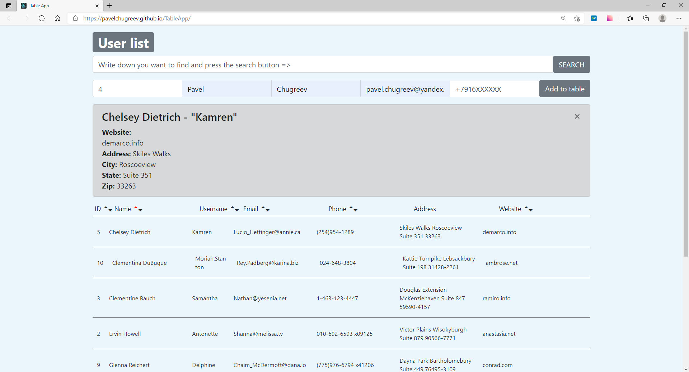

# Users information table

### [Check the table](https://pavelchugreev.github.io/TableApp/)

### About project:
* This app contains information about users
* You can find out id, name, email etc among all users by search panel
* You can add new user by filling all suggested inputs 
* You can sort the most colunms from less to bigger value and back
* When you click on user field the info panel appear over the table
* The table available on different types of screens (desctop, tablet, mobile)
* Data recieved from server by GET response

### Used tools
* HTML5 / CSS(Flex) / Bootstrap
* JavaScript / React
* npm / git
* Rest API [JSON Placeholder](https://jsonplaceholder.typicode.com/)